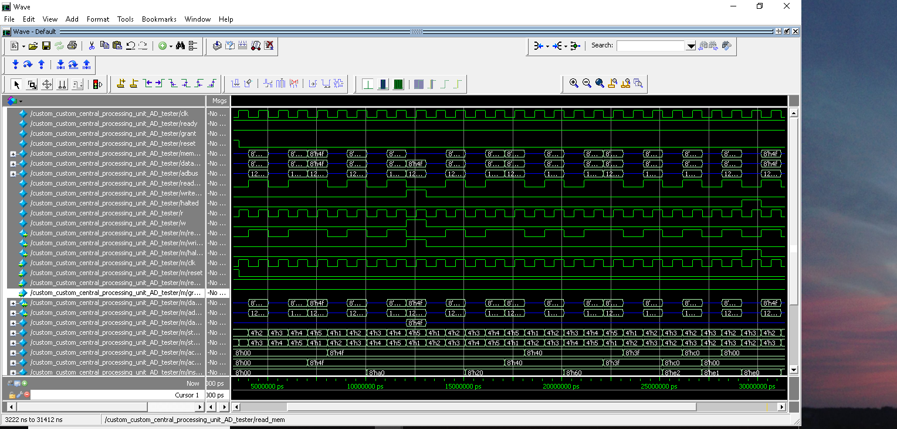
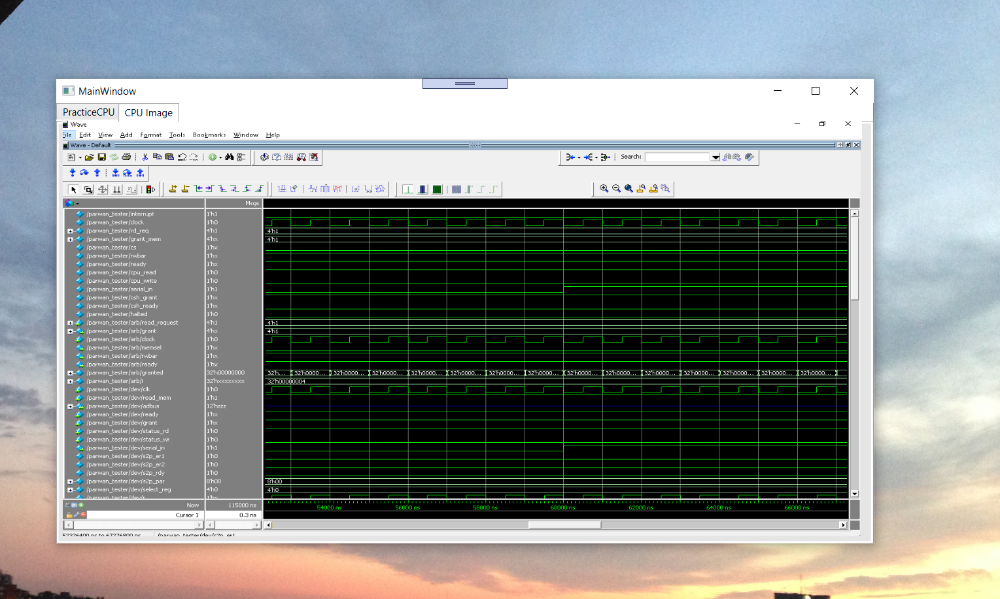
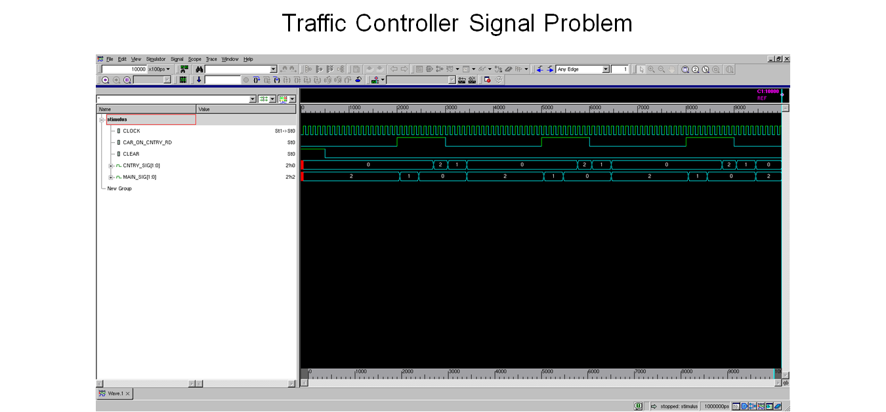
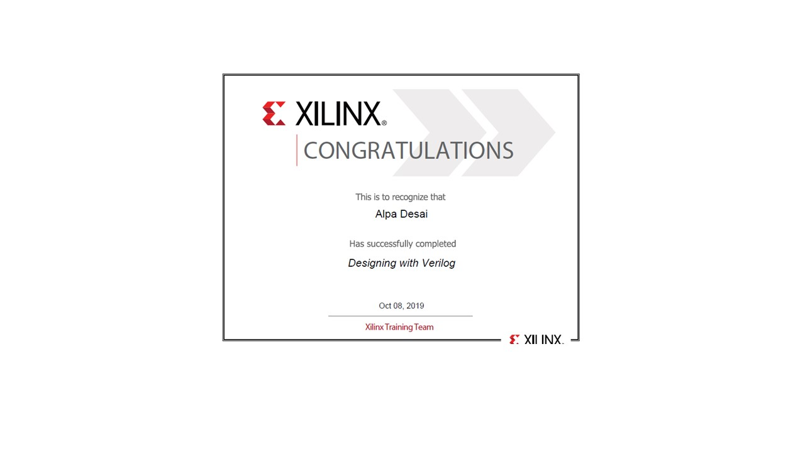

# Digital Logic HDL

The project provides on overview on digital logic HDL

Please click on the executable located in https://github.com/alpaddesai/DigitalLogicHDL/releases for details. 

All images are custom or have a reference name.

## Digital logic 8-bit processor

### Using ModelSim student evaluation version
### Utilizing Verilog HDL

## Traffic Controller Signal Problem

## Verilog Language

## Verilog

## Algorithms

## Ethics and Integrity

## Interest

Advanced knowledge reference : https://github.com/alpaddesai/PowerandInfluentialSkills,  https://github.com/alpaddesai/SystemVerilog,  https://github.com/alpaddesai/ComputerArchitecture and https://github.com/alpaddesai/VerilogHDL

Additional details reference : https://github.com/alpaddesai/HardwareEngineeringLab4-
